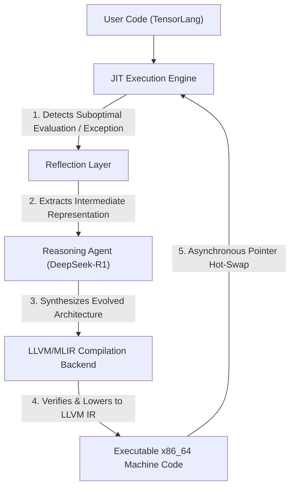

# Architectural Specification: The NeuroJIT Framework

## 1. Abstract / Executive Summary
The NeuroJIT compilation pipeline functions as an autonomous, closed-loop system integrating runtime execution, architectural reflection, and generative inference.

## 2. Component Architecture

### 2.1 The Intermediate Representation: TensorLang
The framework utilizes a specialized Domain Specific Language (DSL) denoted as `TensorLang`. This dialect is constructed within the **MLIR** (Multi-Level Intermediate Representation) infrastructure.
*   **Structural Preservation:** In contrast to traditional compilation paradigms (e.g., C++, Python) which abstract structural logic during lowering, the MLIR implementation preserves geometric and topological operations (e.g., loop nests, matrix dimensions), ensuring the Reasoning Agent parses explicit semantic intent.

### 2.2 The Execution Engine (JIT)
Execution is orchestrated by the **LLVM ORC JIT** framework.
*   **Runtime Observability:** The engine performs continuous evaluation of executable memory.
*   **Diagnostic Interception:** The compiler utilizes `tensorlang.assert` invariants and a `mlir::ScopedDiagnosticHandler` to intercept execution deviations and compilation failures.

### 2.3 The Generative Inference Pipeline
The framework integrates embedded inference systems (e.g., `llama.cpp`) to dynamically generate intermediate representation logic.
*   **Contextual Prompt Formulation:** The Execution Engine synthesizes contextual prompts derived from active runtime failures or performance bottlenecks (e.g., providing the specific `loc(line:col)` diagnostic and the active MLIR module).
*   **Generative Lowering:** The pipeline operates on an asymmetric multi-agent architecture (Reasoning Agent and Synthesis Engine) to return syntactically valid MLIR components.

### 2.4 The Asynchronous Hot-Swap Protocol
Dynamic execution modification is achieved through a multi-stage pointer swap:
1.  The synthesized MLIR is compiled into a dynamic shared object within volatile memory.
2.  The engine employs explicit function pointer indirection.
3.  The active execution pointer is atomically redirected from the deprecated instruction set to the evolved implementation.
4.  The active simulation thread resumes evaluation without interrupting the overarching process lifecycle.
