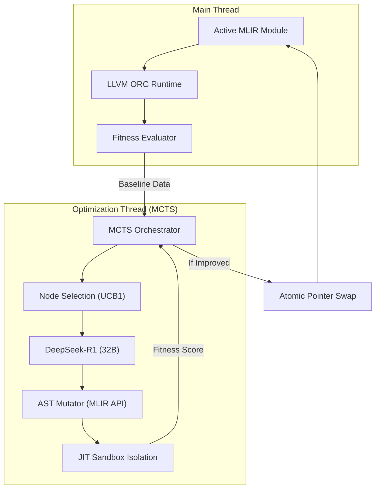

# Technical Architecture: The NeuroJIT Self-Optimization Loop

The NeuroJIT Framework operates as a closed-loop autonomous system where runtime execution metrics guide the evolution of machine code.

## 1. The Optimization Cycle

The core lifecycle of the engine is orchestrated by the `OptimizationWorker`, which manages a Monte Carlo Tree Search (MCTS).

```mermaid
graph TD
    subgraph "Main Thread"
        ActiveCode["Active MLIR Module"] --> Execution["LLVM ORC Runtime"]
        Execution --> Performance["Fitness Evaluator"]
    end

    Performance -- "Baseline Data" --> MCTS
    
    subgraph "Optimization Thread (MCTS)"
        MCTS["MCTS Orchestrator"] --> Selection["Node Selection (UCB1)"]
        Selection --> Prompting["DeepSeek-R1 (32B)"]
        Prompting --> Mutation["AST Mutator (MLIR API)"]
        Mutation --> Sandbox["JIT Sandbox Isolation"]
        Sandbox -- "Fitness Score" --> MCTS
    end

    MCTS -- "If Improved" --> HotSwap["Atomic Pointer Swap"]
    HotSwap --> ActiveCode
```

## 2. Core Components

### 2.1 The AST Mutator (`ASTMutator.cpp`)
The AST Mutator is a specialized C++ class that parses JSON commands from the LLM and applies physical transformations to an in-memory MLIR `ModuleOp`.
*   **Unroll Loop**: Uses `mlir::affine::loopUnrollByFactor` to expand loop bodies, reducing branching overhead.
*   **Tile Loop**: Uses `mlir::affine::tilePerfectlyNested` to improve cache locality for matrix operations.
*   **Verification**: Every mutation is validated via `mlir::verify()` to ensure no invalid IR is ever sent to the JIT.

### 2.2 The Isolated Sandbox (`VerificationSandbox.cpp`)
To prevent crashes in the main process, candidate mutations are compiled and evaluated in an isolated JIT context. 
*   **Safety**: The sandbox captures LLVM diagnostics and prevents invalid code from corrupting the main process state.
*   **Benchmarking**: It measures execution time using `std::chrono` inside a compliant C-Interface wrapper.

### 2.3 The AI Oracle (`LlamaCppModelRunner.cpp`)
A local instance of `llama.cpp` hosting `deepseek-r1-32b-q4_k_m.gguf`.
*   **GBNF Grammar**: Strictly constrains the model output to a valid JSON schema, preventing natural language hallucinations.
*   **Prompt Formulation**: Injects the current IR state and performance history to provide the model with context for reasoning.

### 2.4 The Hot-Swap Integration
When the MCTS loop identifies a mutation with a fitness score strictly higher than the current baseline:
1.  The winner is compiled into the main JIT context.
2.  The symbol address is resolved via the JIT's dynamic library stack.
3.  The main thread's active function pointer is updated atomically.

## 3. Persistent Memory & Lobe Cache
NeuroJIT maintains a "Lobe Cache" of verified optimal MLIR modules.
*   **L1 (Volatile)**: In-process map of optimized functions.
*   **L2 (Persistent)**: Filesystem registry at `~/.neurojit/lobes/`, allowing the system to "remember" optimizations across reboots.
